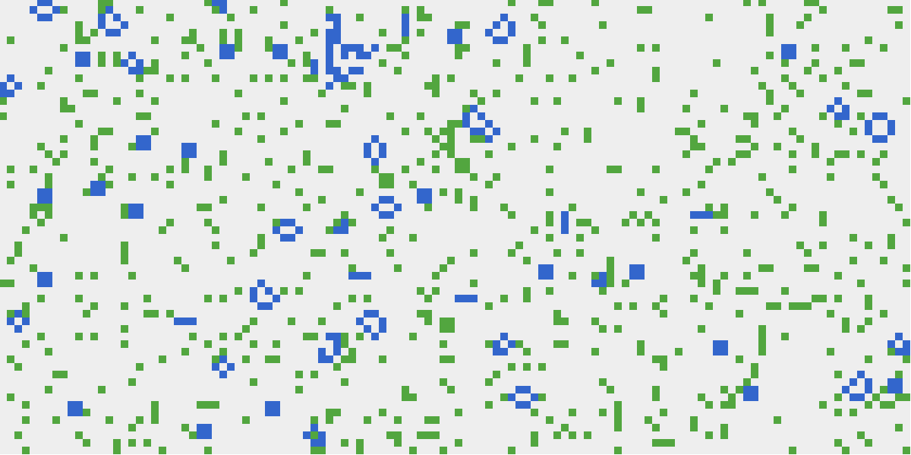

# R20 - Introduce Resource cells

The introduction of this rule is meant to allow some cells to start out as simple resource cells (green on the grid) which simply confer "health" points to cells in their immediate vicinity.

For now:

- resources are not depletable (yet)
- each deemed "alive" cell with `r` Resource cells in its neighborhood simplistically gets `r` health points at start of game.
- the S23 death algo must now decrement health first, and the cell dies only if health is 0.

## Sample end state

- Proceeds as normal. Because resource cells (green) are stable throughout iterations, the game seems to stablize / reach an end state of a few oscillators sooner as there's less opportunity for live cells to "interact". This is with 10% resource cells. Don't expect anything of interest until resources vary, and can be acquired, which requires some interactions first (which in turn require some cell taxis).
